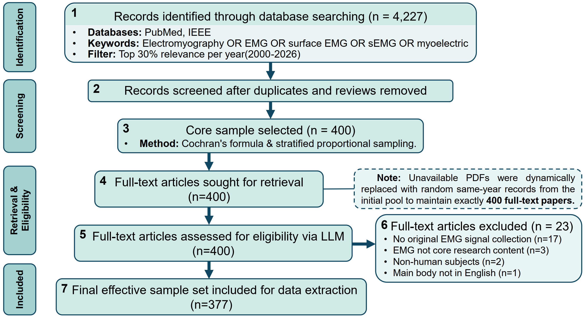

# EMG Demographics Review

This repository implements the **computational pipeline** for the methodological survey **Sex, Age, and Race Representation in Electromyography Research: A Cross-Sectional Methodological Survey**. The study evaluates how **sex, age, and race/skin color** are reported in primary surface EMG research (2000–2026), using a **statistically powered stratified sample** of full-text articles and **LLM-assisted** screening and extraction, validated against human review.

**High-level findings:** among 377 included studies, reporting rates were approximately **88%** for gender, **90%** for age, and **~2.7%** for race or skin color—with stark gaps in transparency for algorithmic fairness and clinical generalizability.

---

## Workflow

The end-to-end process is: database search and relevance filtering → deduplication and exclusion of non-primary literature → **Cochran-based sample size** with **stratified proportional sampling** (by database and year) → full-text retrieval (with **same-stratum replacement** for missing PDFs) → **LLM full-text eligibility screening** → **LLM demographic extraction** and **multi-label domain classification** → **downstream statistics** (reporting rates, stratified tables, chi-square / trend tests).



**Operational CSV for the analyzed cohort:** the working sampled table used by PDF-based scripts is typically **`PDF_Dataset/Sampled_Papers_Stratified.csv`** (377 rows in the primary analysis). Pass it via `--csv-path` where applicable.

---

## Dataset & file layout

| Item | Role |
|------|------|
| **`Flowchart.png`** | Workflow figure shown in **Workflow** above (place this file at the repository root if missing). |
| **`original-csv/`** | Year-wise exports, PubMed parsing (`get_csv_PubMed.py`), merged sampled pool (`merge_sampled_ieee_pubmed.py`, `merged_sampled_ieee_pubmed_2000_2026.csv`, etc.). |
| **`Final_Merged_Dataset.csv`** | Expected input for `random_sample.py` when generating a new stratified CSV at repo root (must be produced/renamed from merge output if needed). |
| **`PDF_Dataset/Sampled_Papers_Stratified.csv`** | Main table for screening + demographics + `Assigned_Categories`; updated **in place** by LLM scripts. |
| **`PDF_Dataset/*.pdf`** | Full texts named by article `ID` (`/` → `_`). |
| **`analysis_outputs/`** | Tables from `source_stats.py`, `relationship.py`, `chi_square_demographics_tests.py`, etc. |
| **`docs/plans/`** | Design notes for major features. |

---

## Key scripts

| Script | Purpose |
|--------|---------|
| `original-csv/get_csv_PubMed.py` | Parse PubMed text export → CSV (e.g. `pubmed_with_abstracts.csv`). |
| `original-csv/merge_sampled_ieee_pubmed.py` | Merge IEEE + PubMed sampled exports into merged CSV under `original-csv/`. |
| `random_sample.py` | Stratified sample by `Year` from `Final_Merged_Dataset.csv` (default 900 rows) → `Sampled_900_Papers_Stratified.csv` at project root. |
| `pdf_extractor.py` | Full-text LLM screening → `Screening_Result`, `Screening_Reason` (resumable). |
| `demographics_extractor.py` | Full-text LLM extraction → demographic columns + status fields (resumable). |
| `source_stats.py` | Normalized counts (database, journal, country) and reporting-rate tables (overall, by year, by database, etc.). |
| `relationship.py` | Sample-size bin tables, topic-level reporting rates, topic × sample-size matrix (full-counting for multi-label). |
| `chi_square_demographics_tests.py` | **χ²** (database × outcome; domain × outcome) and **Cochran–Armitage** trend across ordered sample-size bins. |

---

## Requirements

```bash
pip install pandas biopython tqdm pymupdf openai numpy scipy
```

- **`pymupdf`** supplies `fitz` for PDF text extraction.  
- **`scipy`** is required for `chi_square_demographics_tests.py`.  
- **`biopython`** supports PubMed parsing in `get_csv_PubMed.py`.

---

## Configuration (LLM)

Both `pdf_extractor.py` and `demographics_extractor.py` use an **OpenAI-compatible** HTTP API:

| Variable | Purpose |
|----------|---------|
| `OPENAI_API_KEY` | **Required** |
| `OPENAI_BASE_URL` | Optional (default in code may point to a relay; override for your provider) |
| `SCREENING_MODEL_NAME` | Optional model id for screening / extraction |

CLI flags include `--csv-path`, `--pdf-folder`, `--save-interval`, retry delays, and (for `pdf_extractor`) year filters.

---

## Typical commands

1. **PubMed → CSV** (when starting from a `.txt` export):

   ```bash
   python original-csv/get_csv_PubMed.py
   ```

2. **Merge IEEE + PubMed** sampled exports:

   ```bash
   python original-csv/merge_sampled_ieee_pubmed.py
   ```

3. **Optional:** new stratified list from merged master file:

   ```bash
   python random_sample.py
   ```

4. **Place PDFs** under `PDF_Dataset/` and keep rows aligned with `PDF_Dataset/Sampled_Papers_Stratified.csv`.

5. **Full-text screening:**

   ```bash
   python pdf_extractor.py --csv-path "PDF_Dataset/Sampled_Papers_Stratified.csv" --pdf-folder "PDF_Dataset"
   ```

6. **Demographic extraction:**

   ```bash
   python demographics_extractor.py --csv-path "PDF_Dataset/Sampled_Papers_Stratified.csv" --pdf-folder "PDF_Dataset"
   ```

7. **Source & reporting-rate summaries:**

   ```bash
   python source_stats.py --csv-path "PDF_Dataset/Sampled_Papers_Stratified.csv" --output-dir "analysis_outputs/source_stats"
   ```

8. **Sample-size bins, topics, matrices:**

   ```bash
   python relationship.py
   ```

9. **Chi-square & Cochran–Armitage tests:**

   ```bash
   python chi_square_demographics_tests.py
   ```

Full narrative and equations (Cochran’s formula, stratification, replacement protocol, validation) appear in the associated publication’s Methods section when available.

---

## Outputs (selected)

- **Screening:** `Screening_Result`, `Screening_Reason` (values include `include`, `exclude`, `uncertain`, `pdf_missing`, `pdf_read_error`, `api_error`).  
- **Demographics:** `Sample_Size`, `Gender_Details`, `Age_Details`, `Race_Ethnicity_Details`, `Country_of_Study`, `Extraction_Notes`, `Demographics_Extraction_Status`, `Demographics_Extraction_Error`.  
- **Domains:** `Assigned_Categories` (comma + space separated multi-label; six predefined domains in the survey).  
- **`analysis_outputs/source_stats/`** — database / journal / country counts; overall and stratified reporting-rate CSVs.  
- **`analysis_outputs/sample_size_bins.csv`**, **`topic_demographics_reporting_rates.csv`**, **`topic_category_sample_size_share_matrix.csv`** — from `relationship.py`.  
- **`analysis_outputs/chi_square_demographics_tests.txt`** — statistical test output.

---

## Notes & limitations

- **LLM outputs can be wrong**; human validation on a gold-standard subset was part of the study design—use extracted fields as **assistive**, not definitive, without spot checks.  
- **Resumability:** rows with existing `Screening_Result` or `Demographics_Extraction_Status` are skipped on re-runs.  
- **Truncation:** full text sent to the API is capped (e.g. first **100,000** characters in `demographics_extractor.py` / `pdf_extractor.py`); verify that Methods/Participants remain covered.  
- **Multi-label domains:** expanded-row analyses (`relationship.py`, domain χ² in `chi_square_demographics_tests.py`) treat each paper–category pair as a row; **observations are not fully independent**—interpret exploratory analyses accordingly.  
- **Cohort vs. `random_sample.py`:** the primary workflow targets **~400 full texts** and **377** analyzed studies; `random_sample.py` defaults to **900** and a root-level CSV filename—adjust if you regenerate a cohort to match that design.

---

## Next steps (engineering)

- Single entrypoint (e.g. Makefile) wiring merge → sample → screen → extract → analysis.  
- `requirements.txt` / `pyproject.toml` with pinned versions.  
- Extend automated tests beyond existing `pdf_extractor` / `demographics` / `relationship` / `source_stats` coverage.

---

## Citation

If you use this repository or the survey design, cite the associated paper once it is published (authors, title, venue, and DOI will appear with the official publication).
