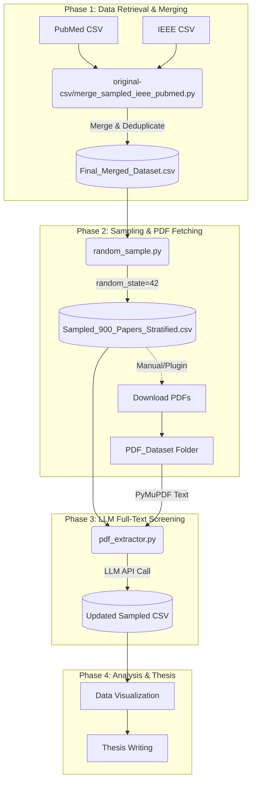

# EMG Demographics Review — Project Overview

This repository contains scripts and datasets for a systematic review of participant demographics reported in Electromyography (EMG) studies. The workflow covers collecting records from PubMed and IEEE Xplore, merging exports, stratified sampling, downloading full-text PDFs, and running LLM-based full-text screening (include/exclude/uncertain) to support manual verification.

## Workflow



## Dataset
- Original exports from PubMed and IEEE Xplore are placed under the project root (e.g., `export*.csv`, `pubmed-Electromyo-set.txt`).
- `Final_Merged_Dataset.csv`: the merged dataset that `random_sample.py` reads. This should be created by running `original-csv/merge_sampled_ieee_pubmed.py` and renaming/copying its output to `Final_Merged_Dataset.csv` (the merge script’s default output lives under `original-csv/`).
- `Sampled_900_Papers_Stratified.csv`: stratified sample generated by `random_sample.py` (default `total_sample_size=900`).
- `PDF_Dataset/`: directory to store downloaded PDFs (named by article ID with `/` replaced by `_`).

## Key Scripts
- `original-csv/get_csv_PubMed.py` — Parse the PubMed text export and produce `original-csv/pubmed_with_abstracts.csv`.
- `original-csv/merge_sampled_ieee_pubmed.py` — Merge sampled IEEE and PubMed CSV exports into a merged file under `original-csv/` (see script defaults / CLI args).
- `random_sample.py` — Stratified sampling by `Year` from `Final_Merged_Dataset.csv` and writes `Sampled_900_Papers_Stratified.csv` in the project root.
- `pdf_extractor.py` — Read PDFs from `PDF_Dataset`, send full text to an LLM, and write full-text screening results back into the sampled CSV (resumable/incremental via in-place updates to `--csv-path`).
- `demographics_extractor.py` — Read PDFs from `PDF_Dataset`, send full text to an LLM, and extract demographic fields back into the sampled CSV (resumable via in-place updates to `--csv-path`).

## Requirements
- Python 3.8+
- Install dependencies:

```bash
pip install pandas biopython tqdm pymupdf openai
```

Adjust versions as needed. `pymupdf` provides `fitz` for PDF parsing; `biopython` provides `Bio.Medline` for PubMed parsing.

## Configuration
- `pdf_extractor.py` expects an OpenAI-compatible API:
  - Set `OPENAI_API_KEY` (required).
  - Optionally set `OPENAI_BASE_URL` (default: `https://api.ttk.homes/v1`).
  - Optionally set `SCREENING_MODEL_NAME` (default: `gemini-2.5-pro-cli`).
- `pdf_extractor.py` also accepts CLI args like `--csv-path`, `--pdf-folder`, `--year-start`, `--year-end`, `--save-interval`, and retry settings.
- `demographics_extractor.py` uses the same API/environment variables and supports CLI args like `--csv-path`, `--pdf-folder`, `--save-interval`, and retry settings.

## Typical Workflow
1. Convert PubMed text export to CSV:

```bash
python original-csv/get_csv_PubMed.py
```

2. Merge PubMed and IEEE exports:

```bash
python original-csv/merge_sampled_ieee_pubmed.py
```

   - After the merge finishes, make sure the merged CSV exists at `Final_Merged_Dataset.csv` (rename/copy from `original-csv/` if needed), because `random_sample.py` reads that exact filename.

3. Create a stratified sample (default `total_sample_size=900` in `random_sample.py`):

```bash
python random_sample.py
```

4. Manually download full-text PDFs for sampled records into `PDF_Dataset/`. Name each file as `<ID with '/' replaced by '_'>.pdf`.

5. Run full-text screening (this will call the LLM and update `Screening_Result` / `Screening_Reason` in the sampled CSV):

```bash
python pdf_extractor.py --csv-path "Sampled_900_Papers_Stratified.csv" --pdf-folder "PDF_Dataset"
```

6. Extract participant demographic details from the full text (this will call the LLM and add/fill demographic columns in the sampled CSV):

```bash
python demographics_extractor.py --csv-path "Sampled_900_Papers_Stratified.csv" --pdf-folder "PDF_Dataset"
```


## Outputs
- `Final_Merged_Dataset.csv`: merged and cleaned title/abstract dataset.
- `Sampled_900_Papers_Stratified.csv`: sampled lists.
- The sampled CSV you pass via `--csv-path` will be updated in-place with `Screening_Result` and `Screening_Reason` columns.
- The sampled CSV you pass via `--csv-path` will be updated in-place with these demographic columns:
  - `Sample_Size`, `Gender_Details`, `Age_Details`, `Race_Ethnicity_Details`, `Country_of_Study`, `Extraction_Notes`
  - `Demographics_Extraction_Status`, `Demographics_Extraction_Error`

## Notes & Best Practices
- LLM outputs can hallucinate; always perform manual checks of screening decisions before using them in analysis.
- `pdf_extractor.py` implements resumable behavior: if `Screening_Result` is already present for a row, it will skip that row (so interrupted runs can resume safely).
- `pdf_extractor.py` truncates full text to the first 100,000 characters to keep payloads reasonable — this usually includes Methods/Participants sections but verify if more context is needed.
- `demographics_extractor.py` implements resumable behavior: if `Demographics_Extraction_Status` is already present for a row, it will skip that row.
- `Screening_Result` values:
  - `include`, `exclude`, `uncertain`
  - `pdf_missing`, `pdf_read_error`, `api_error`
- `Demographics_Extraction_Status` values:
  - `success`, `pdf_missing`, `pdf_read_error`, `api_error`
- Adjust `save_interval` and retry settings in scripts to balance speed and reliability.

## Next Steps
- Add/standardize a single pipeline entrypoint (e.g., a Makefile or orchestrator) so merge/sample/screen steps are fully automated.
- Parameterize sampling size and default filenames to reduce manual copying/renaming.
- Add basic unit tests or a `requirements.txt` / `pyproject.toml` for reproducibility (there is already `test_pdf_extractor_screening.py` for `pdf_extractor.py`).


